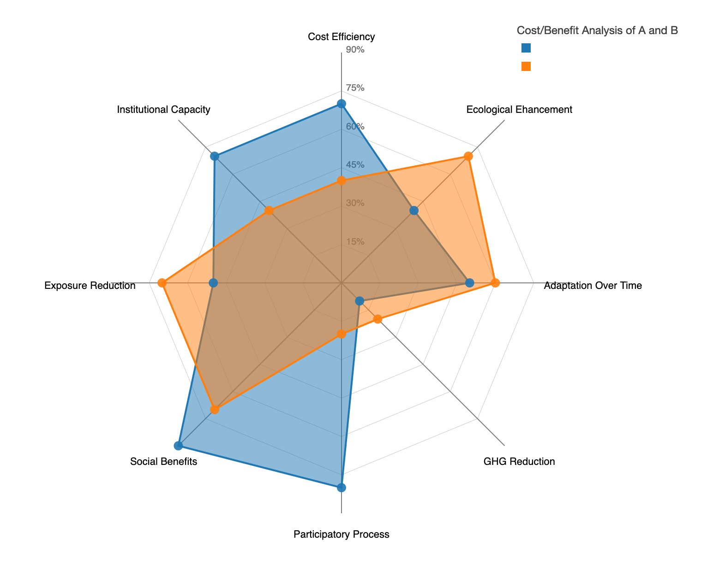

# dataviz

Some visualizations I have worked on.

## Climate Change Project

Full project report [here](https://info-248.web.app/climate_analysis.html)

### Monthly Temperature Change - Created using R

### [Climate Dashboard](https://adityanar.shinyapps.io/Maps/) - Creating using R/Shiny

## Analysis of NYC Property Dataset in Tableu 

## Project Enviz 

Worked on a project with a environmental science professor to compare two environmental science projects based on 8 factors. 
### Spyder Chart Created Dynamically with D3.js

## Project RAISE - College of Education 

## FIFA 19 Dataset Visualizations 

